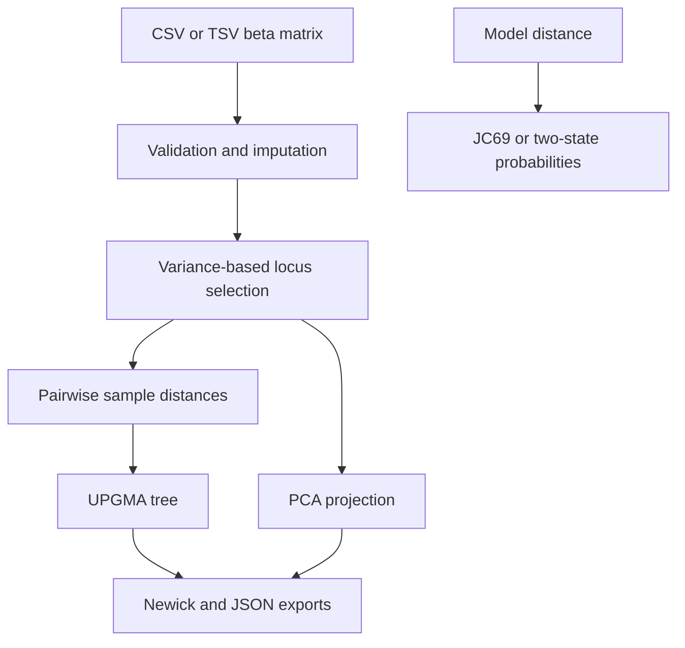

# Architecture

MethylPhylo Studio deliberately separates the scientific core from its delivery surfaces.

## Components

| Component | Responsibility |
| --- | --- |
| `src/methylphylo/core.py` | Typed matrix model, validation, preprocessing, distances, UPGMA, Newick, transition probabilities |
| `src/methylphylo/cli.py` | Reproducible command-line analysis and file outputs |
| `dist/` | Zero-install browser application with equivalent client-side workflow |
| `tests/` | Scientific invariants and reproducibility checks |
| `.github/workflows/ci.yml` | Tests and static checks on Python 3.10 and 3.12 |

## Design decisions

- **Median imputation by locus:** easy to explain and deterministic; the missingness rate is always reported.
- **Variance selection:** reduces noise and browser workload without using outcome labels.
- **RMS Euclidean distance:** normalizes for the number of selected loci. Manhattan and correlation distances are available for sensitivity analysis.
- **UPGMA:** produces an interpretable rooted dendrogram but assumes an ultrametric structure. Results are exploratory, not an evolutionary claim.
- **Separated probability models:** JC69 is available for nucleotide substitution distances, while a symmetric binary model represents a simplified methylation-state process. Neither silently reinterprets continuous beta-value distances.
- **Local browser processing:** uploaded matrices are not sent to a server.

## Production extension path

For large cohorts, the Python core can move behind a job API and object store while preserving the input/output contract. A workflow engine can shard preprocessing by chromosome and write provenance, parameters, checksums, and versioned artifacts alongside each run.
